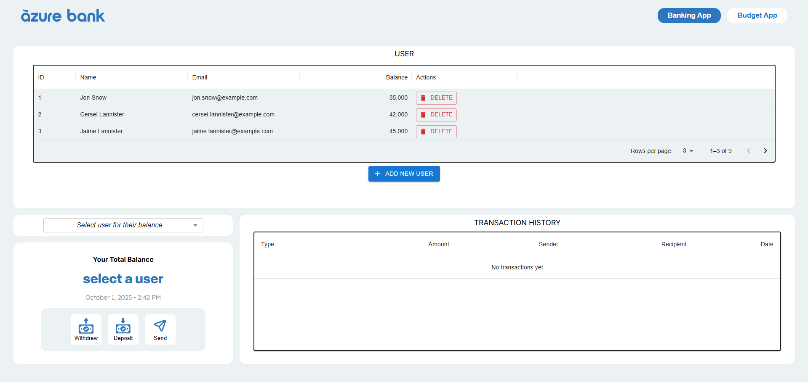
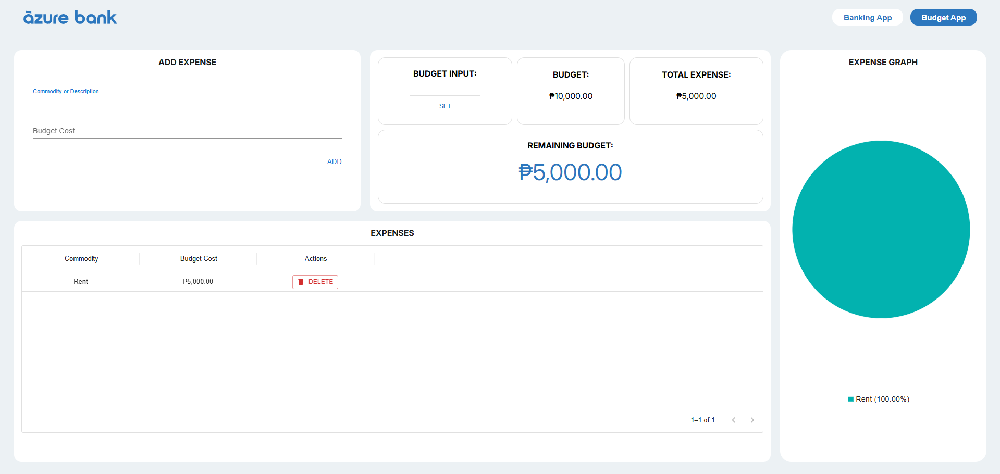

# Banking & Budget App

A simple admin-style **banking and budget application** built with **React** and **Material UI**. This project allows users to perform core banking transactions such as **transfers**, **deposits**, and **sending money**. It also includes a **budget tracking** section where users can visualize their **expenses through graphs**.

This was our **first project using React**, and it helped us learn key concepts of frontend development and working with UI component libraries like Material UI.

## 🚀 Features

- 💸 Transfer, deposit, and send money  
- 📄 Transaction history tracking  
- 📊 Budget tracker with expense visualization  
- 🧩 Admin-style layout using Material UI

## 🛠️ Tech Stack

- React  
- Material UI  
- JavaScript  
- HTML/CSS  

## 📸 Screenshots  

### 🏦 Banking App (Admin Dashboard)  
- Send, withdraw, and deposit funds  
- Manage users (create/delete)  
- View transaction history  

### 📊 Budget App  
- Set a budget  
- Create expenses  
- Visualize expenses in a pie chart  

## 👥 Developed By

- emmant-web  
- pgdedios
